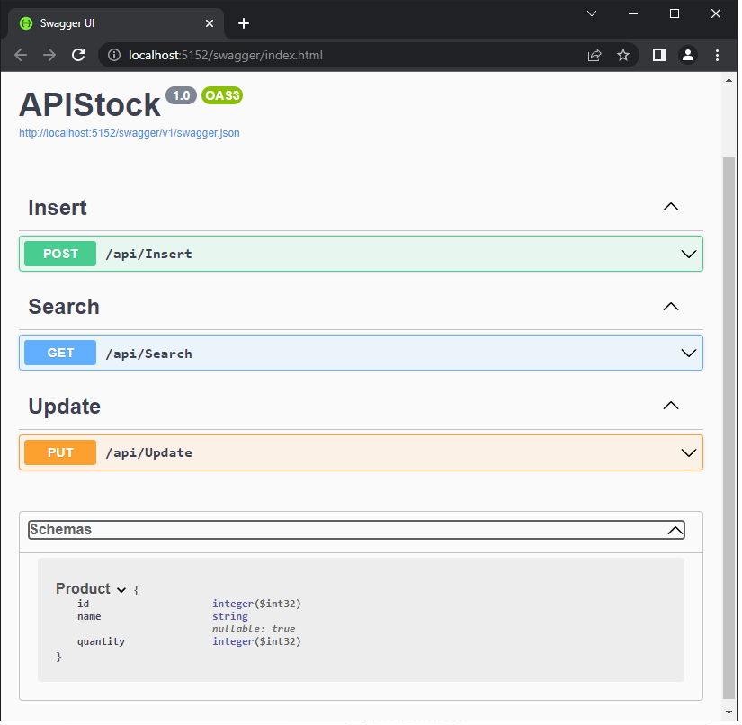
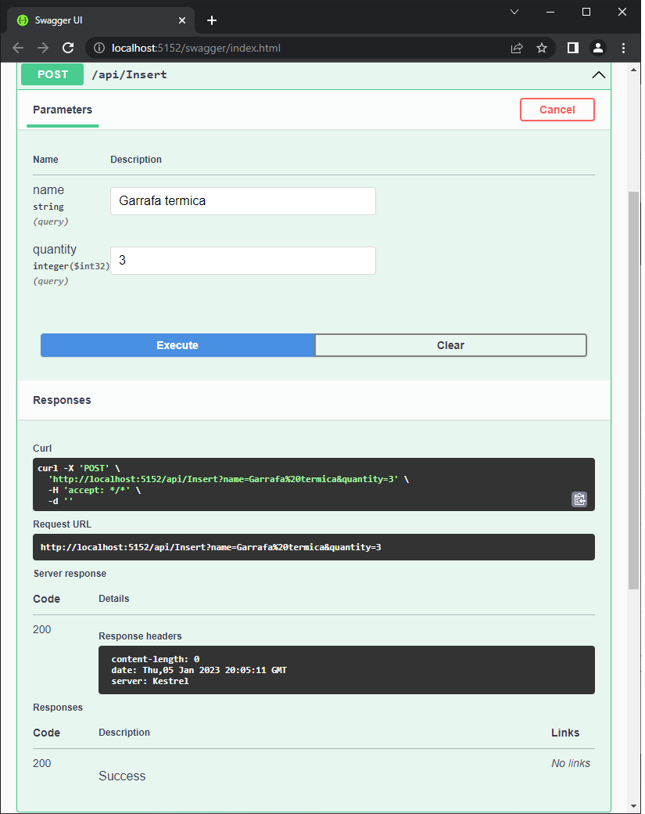
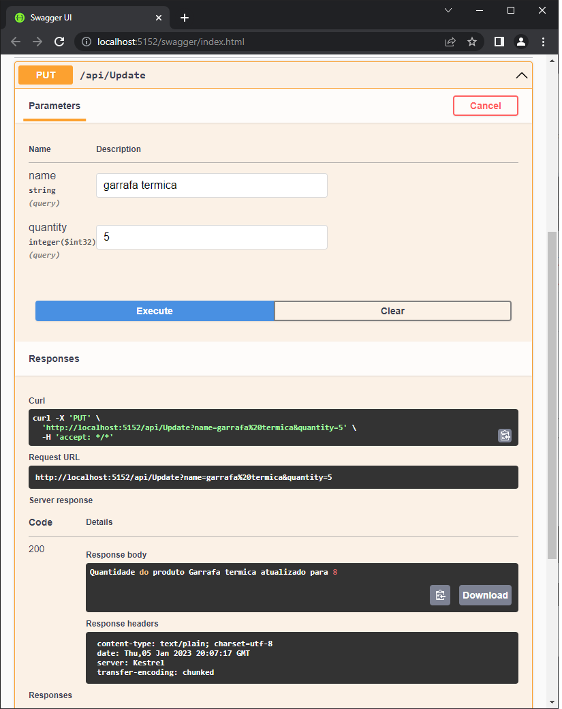
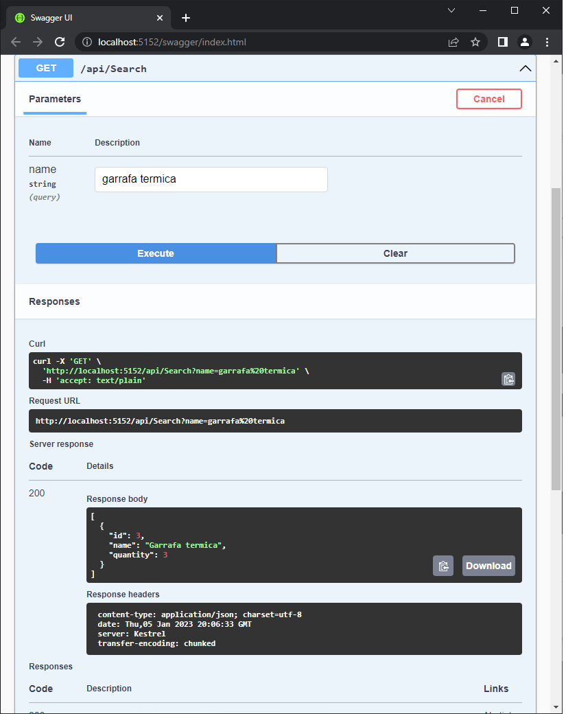

<h2>Projeto com finalidade de estudo e prática.</h2>

<h3>A API possui um sistema de cadastro de itens de estoque. </h3>

Assim, pode ser cadastrado o nome do produto e a quantidade dele.

É possível atualizar a quantidade de produtos em estoque buscando pelo nome do produto.

Por fim o usuário também pode fazer uma pesquisa se determinado item está cadastrado no banco de dados, ou visualizar todos os produtos cadastrados.

<h3>Necessário para testar em sua máquina.</h3>

1- Instalar pacote de ferramentas do Entity Framework na máquina:

dotnet tool install --global dotnet-ef

2- Instalar o suporte para criação de tabelas dentro do projeto:

dotnet add package Microsoft.EntityFrameworkCore.Design --version 7.0.1

3- Instalar o suporte a conexão com banco de dados e gerenciamento dos códigos dentro do projeto (se for utilizar o SQLServer): 

dotnet add package Microsoft.EntityFrameworkCore.SqlServer --version 7.0.1

4- Por fim, criar o banco de dados local no CLI da IDE:

dotnet ef database update
